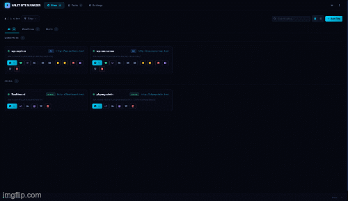
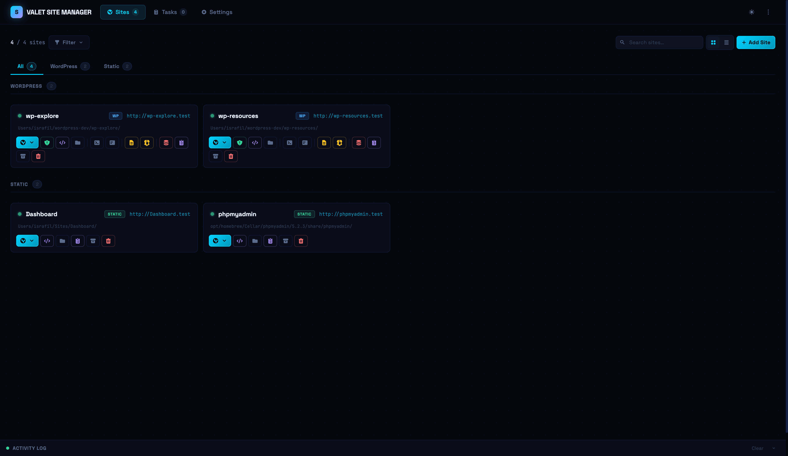
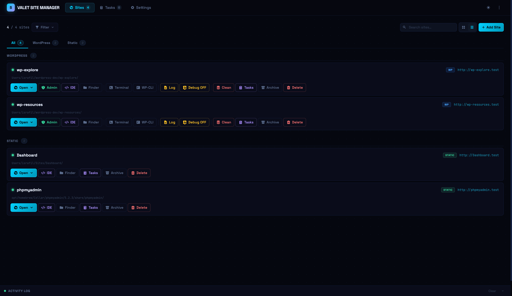
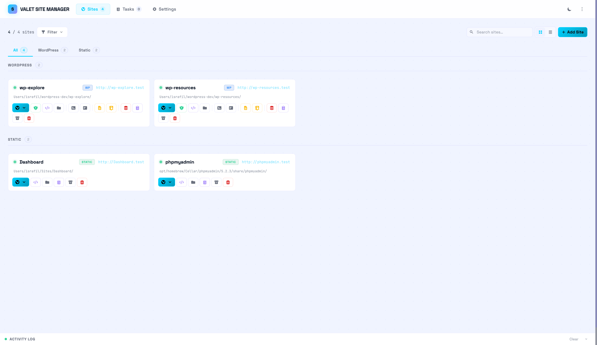
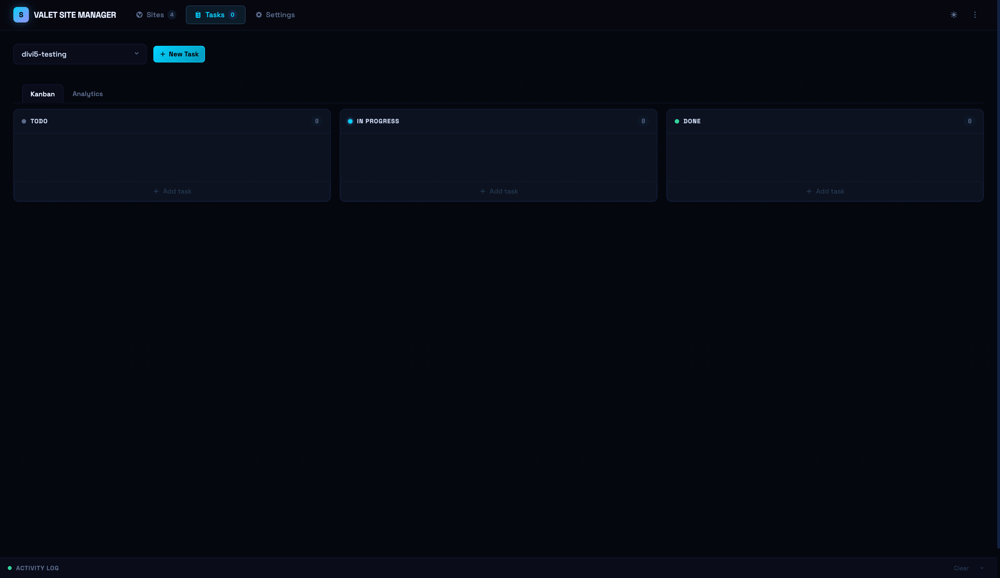
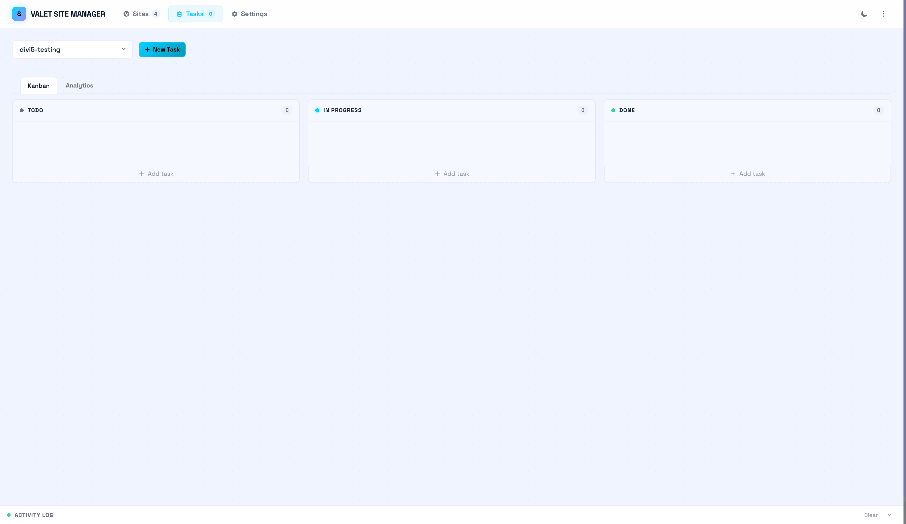
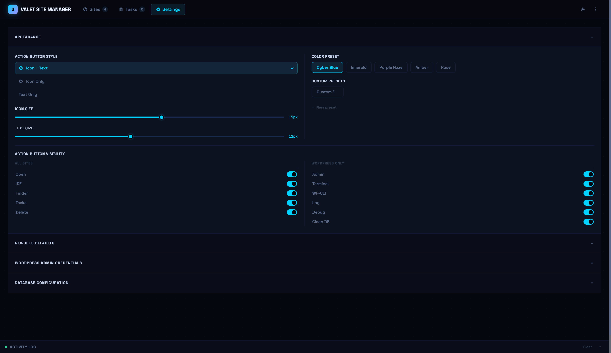
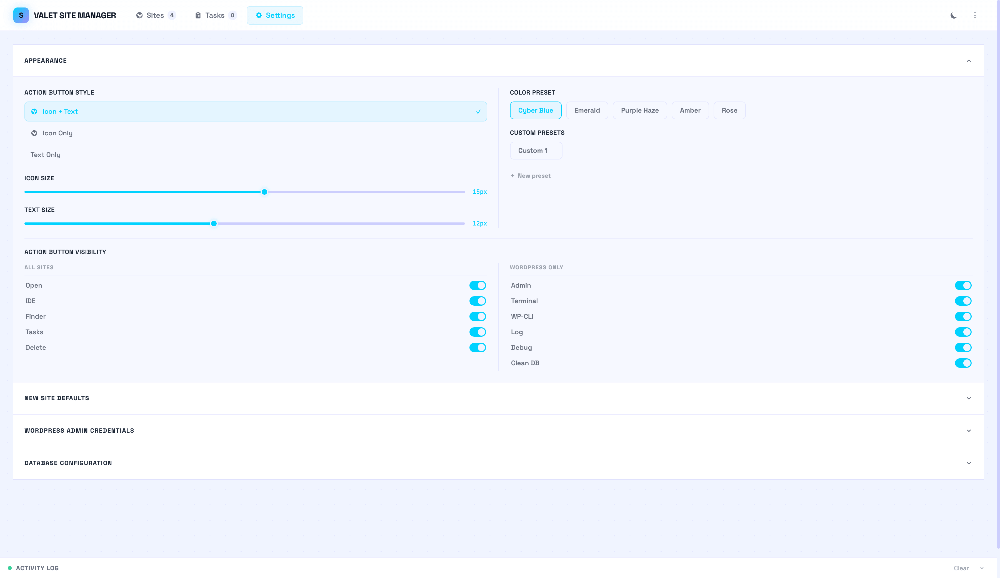
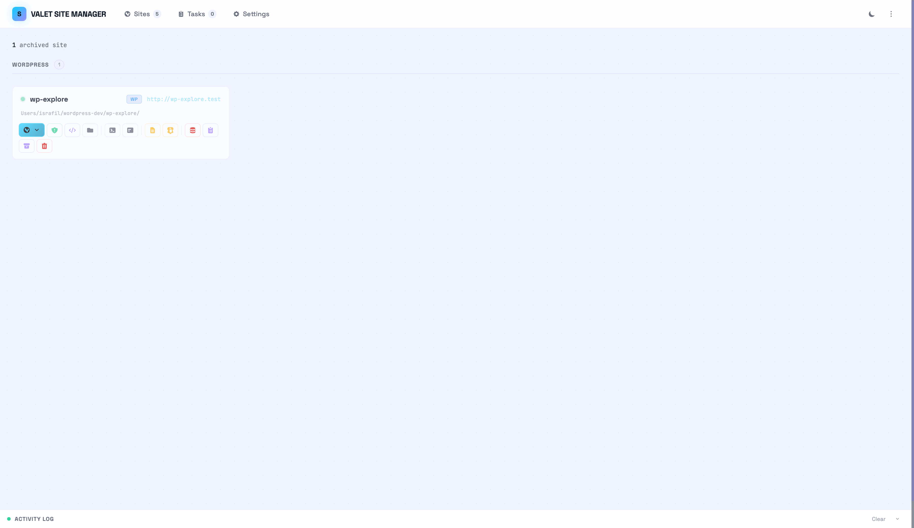

# Valet Site Manager — Setup & Usage Guide

A local WordPress development dashboard served through Laravel Valet. Manage all your sites, tasks, and tooling from one place at **http://valet-site-manager.test**.

## Demo



## Screenshots

<p align="center">
  
  
  
  
  
  
  
  
  
</p>


---

## Prerequisites

- Mac running macOS 12 Monterey or later
- Admin access (some steps require `sudo`)
- Terminal (built-in Terminal.app or iTerm2)
- **phpMyAdmin** _(optional but recommended)_ — for a GUI database browser at `http://phpmyadmin.test`

---

## Part 1 — Install the Stack

### Step 1 — Xcode Command Line Tools

```bash
xcode-select --install
```

A dialog will appear — click **Install**. This takes a few minutes. Required for Git and build tools.

### Step 2 — Homebrew

```bash
/bin/bash -c "$(curl -fsSL https://raw.githubusercontent.com/Homebrew/install/HEAD/install.sh)"
```

When it finishes, follow the **"Next steps"** printed at the end to add Homebrew to your PATH. For Apple Silicon Macs this usually means adding this to `~/.zprofile`:

```bash
echo 'eval "$(/opt/homebrew/bin/brew shellenv)"' >> ~/.zprofile
eval "$(/opt/homebrew/bin/brew shellenv)"
```

Verify:
```bash
brew --version
```

### Step 3 — PHP

```bash
brew install php
```

Verify:
```bash
php -v   # should print PHP 8.x.x
```

### Step 4 — Composer

```bash
brew install composer
```

Add Composer's global bin to your PATH. Open `~/.zshrc` (or `~/.zprofile`) and add:

```bash
export PATH="$HOME/.composer/vendor/bin:$PATH"
```

Reload:
```bash
source ~/.zshrc
```

Verify:
```bash
composer --version
```

### Step 5 — Laravel Valet

```bash
composer global require laravel/valet
valet install
```

Valet installs Nginx, sets up a local DNS resolver for `.test` domains, and starts running as a background service.

Verify:
```bash
valet --version
ping -c1 anything.test   # should resolve to 127.0.0.1
```

### Step 6 — MySQL

```bash
brew install mysql
brew services start mysql
```

Secure the installation (set a root password if you want one):
```bash
mysql_secure_installation
```

> **Tip:** Valet Site Manager defaults to `root` with no password (`host: 127.0.0.1`). If you set a password, enter it in **Settings → DB Config** after setup.

Verify MySQL is running:
```bash
brew services list | grep mysql
```

### Step 7 — phpMyAdmin

phpMyAdmin gives you a browser-based GUI for managing your MySQL databases. Install it via Homebrew and link it as a Valet site so it's always available at **http://phpmyadmin.test**.

#### Install

```bash
brew install phpmyadmin
```

#### Configure

Copy the sample config and open it for editing:

```bash
cp "$(brew --prefix)/share/phpmyadmin/config.sample.inc.php" \
   "$(brew --prefix)/share/phpmyadmin/config.inc.php"
open "$(brew --prefix)/share/phpmyadmin/config.inc.php"
```

Make two changes inside `config.inc.php`:

**1. Set a blowfish secret** (any random 32-character string — used to encrypt cookies):

```php
$cfg['blowfish_secret'] = 'your-32-character-random-string!!';
```

Generate one quickly:
```bash
openssl rand -base64 32 | tr -dc 'a-zA-Z0-9' | head -c 32
```

**2. Set the host to `127.0.0.1`** (find the `$i = 1` server block):

```php
$cfg['Servers'][$i]['host'] = '127.0.0.1';
```

#### Link with Valet

```bash
cd "$(brew --prefix)/share/phpmyadmin"
valet link phpmyadmin
```

Verify the link:
```bash
valet links   # phpmyadmin → /opt/homebrew/share/phpmyadmin (or /usr/local/...)
```

Visit **http://phpmyadmin.test** — log in with your MySQL `root` credentials (password set in Step 6, or blank if you skipped `mysql_secure_installation`).

> **Tip:** Run `valet secure phpmyadmin` to serve it over HTTPS at `https://phpmyadmin.test`.

---

### Step 8 — WP-CLI

```bash
brew install wp-cli
```

Verify:
```bash
wp --version
```

If `wp` is not found by Valet's PHP process later, symlink it:
```bash
sudo ln -sf $(which wp) /usr/local/bin/wp
```

---

## Part 2 — Set Up Your Dev Environment

### Step 8 — Create a sites directory and park it with Valet

```bash
mkdir ~/wordpress-dev
cd ~/wordpress-dev
valet park
```

`valet park` tells Valet to automatically serve every subdirectory here as `<folder-name>.test`. Any new folder you create instantly gets a `.test` domain — no extra config needed.

### Step 9 — Place Valet Site Manager

Clone or copy the `valet-site-manager` folder into your sites directory:

```bash
# If cloning from a repo:
git clone <repo-url> ~/wordpress-dev/valet-site-manager

# Or if you already have it, just move it:
mv /path/to/valet-site-manager ~/wordpress-dev/valet-site-manager
```

Because `~/wordpress-dev` is already parked, `valet-site-manager.test` resolves automatically. You only need to explicitly link it if the folder is **not** inside a parked directory:

```bash
cd ~/wordpress-dev/valet-site-manager
valet link valet-site-manager
```

Verify the link exists:
```bash
valet links
```

### Step 10 — Open the dashboard

Visit **http://valet-site-manager.test** in your browser.

You should see the dashboard listing all sites under `~/wordpress-dev`.

---

## Part 3 — Configuration

### Settings → WP Admin Config

Set the default admin credentials used when creating new WordPress sites and for one-click auto-login.

| Field    | Default | Notes                                          |
|----------|---------|------------------------------------------------|
| Username | admin   |                                                |
| Password | admin   |                                                |
| Email    | _(auto)_ | Use `{sitename}` as a placeholder, e.g. `admin@{sitename}.test` |

### Settings → DB Config

Set the MySQL connection details used when creating new sites.

| Field    | Default   |
|----------|-----------|
| Host     | 127.0.0.1 |
| User     | root      |
| Password | _(empty)_ |

### Settings → New Site Defaults

Pre-fill the plugins and themes to install on every new WordPress site. One per line, using the WordPress.org slug or a URL to a zip file.

### Settings → Appearance

Switch between built-in color presets (Cyber, Emerald, Purple, Amber, Rose) or create your own custom preset using the color picker.

---

## Part 4 — Using the Dashboard

### Site Cards

Every site under your parked directory appears as a card. Each card shows:

- Site name and `.test` URL
- Quick-launch buttons:

| Button   | Action                                              |
|----------|-----------------------------------------------------|
| **Open** | Opens the site URL in your default browser          |
| **Admin** | One-click login to `wp-admin` (WordPress sites)    |
| **Terminal** | Opens a Terminal window `cd`'d into the site root |
| **WP-CLI** | Opens Terminal running `wp shell` in the site     |
| **Finder** | Opens the site folder in Finder                   |
| **VS Code / Cursor / PHPStorm** | Opens the site in your IDE     |

You can choose which buttons to show in **Settings → Appearance → Action Buttons**.

### Create a New Site

Click **New Site** in the top navigation.

**WordPress site:**
1. Enter a site name (lowercase, hyphens allowed — becomes the `.test` domain)
2. Select **WordPress** as the type
3. Optionally override plugins, themes, or folder structure for this site
4. Click **Create**

The dashboard will run the full WordPress install — core download, database creation, config, install, plugins, themes, and Valet link — and stream each step live in the activity log.

**Static site:**
1. Enter a site name
2. Select **Static** as the type
3. Optionally provide a JSON folder structure to scaffold
4. Click **Create**

### One-Click Admin Login

Each WordPress site card has an **Admin** button that automatically logs you into `wp-admin` without typing credentials. It reads the username/password from **Settings → WP Admin Config**.

### Debug Log

Click the **Bug** icon on any WordPress site card to:
- Toggle `WP_DEBUG` / `WP_DEBUG_LOG` on or off
- View the last 300 lines of `wp-content/debug.log` in a live panel
- Clear the log with one click

### Database Cleaner

Click the **DB** icon on any site card to:
- Flush the object cache (`wp cache flush`)
- Delete all transients (`wp transient delete --all`)
- Delete all post revisions

### Tasks

Click **Tasks** in the top navigation to open the task board for any site. Each site has its own task list. Tasks support:

- Title, description, priority (low / medium / high), due date
- Status: **Todo → In Progress → Done**
- Subtasks with individual status tracking
- A ring progress indicator on each card

### Activity Log

The activity log opens automatically whenever an action runs (create site, debug toggle, DB clean, etc.). It shows a terminal-style output of every command executed, with exit status, the exact command run, and its output — just like a real terminal.

---

## Part 5 — Folder Structure

```
wordpress-dev/
├── valet-site-manager
├── my-project/            ← WordPress site → my-project.test
├── client-site/           ← Another site → client-site.test
└── static-site/           ← Static site → static-site.test
```

`database.json` is created automatically on first use and stores all tasks and settings. It is safe to edit manually — the app will migrate any old format automatically.

---

## Troubleshooting

**Site not loading at `.test`**
```bash
valet start          # ensure Valet is running
valet links          # confirm valet-site-manager is linked
ping -c1 valet-site-manager.test   # should return 127.0.0.1
```

**`wp: command not found` during site creation**
```bash
sudo ln -sf $(which wp) /usr/local/bin/wp
```

**MySQL connection refused when creating a site**
```bash
brew services start mysql
```
Then confirm your credentials in **Settings → DB Config**.

**Auto-login fails**
Confirm the username and password in **Settings → WP Admin Config** match the actual WP admin account for that site.

**PHP version mismatch**
```bash
php -v          # CLI version
valet php -v    # Valet's PHP version
```
Both should match. Switch with `valet use php@8.2` if needed.

**phpMyAdmin not loading at `phpmyadmin.test`**
```bash
valet links               # confirm phpmyadmin is listed
valet start               # ensure Valet/nginx is running
ping -c1 phpmyadmin.test  # should return 127.0.0.1
```
If the link is missing, re-run:
```bash
cd "$(brew --prefix)/share/phpmyadmin" && valet link phpmyadmin
```

**phpMyAdmin shows "The configuration file now needs a secret passphrase"**

You skipped setting `blowfish_secret`. Open `config.inc.php` (path from `brew --prefix phpmyadmin`) and set it to any 32-character string.

**phpMyAdmin "Access denied for user 'root'@'localhost'"**

Make sure the host in `config.inc.php` is `127.0.0.1`, not `localhost`. MySQL on macOS uses a socket for `localhost` but TCP for `127.0.0.1`.

```php
$cfg['Servers'][$i]['host'] = '127.0.0.1';
```

**Permission denied errors**
```bash
sudo chown -R $(whoami) ~/wordpress-dev
```
